# 🧭 Thesis GPS

> **A shared, living roadmap for every thesis — navigated by AI, owned by everyone on the journey.**

The Thesis GPS is a directed milestone graph that evolves with the student's progress. It is visible to the student, their supervisor, and relevant company partners simultaneously. The AI doesn't just chat — it proposes structural changes to the roadmap and activates the right people from the network at the right milestone.

---

## 🗺️ The Workspace

Each node is a milestone. Edges encode dependencies. The graph branches when multiple valid paths exist, shows blocked nodes when prerequisites are missing, and highlights the active milestone with live subtask progress.

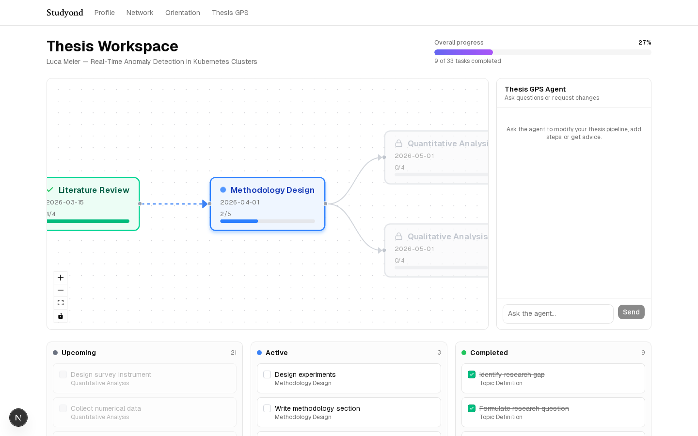

The wide layout shows the full thesis journey alongside the Kanban task board and the AI chat panel — the complete picture in one view.

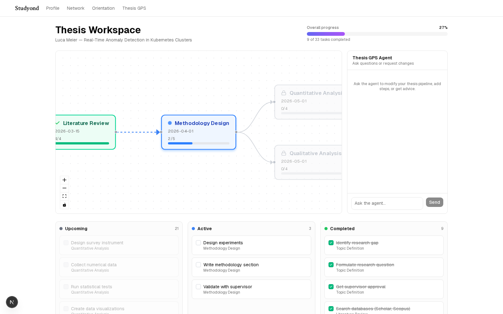

What the graph looks like at runtime:

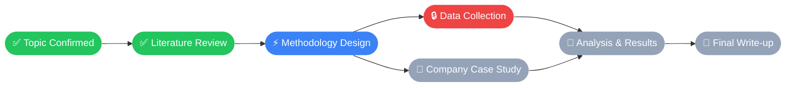

> ✅ completed · ⚡ active · 🔒 blocked · 📅 upcoming

---

## ⚙️ System Strengths

### 🤖 Multi-Agent, Stateful Architecture

Two coordinated Claude agents power the workspace:

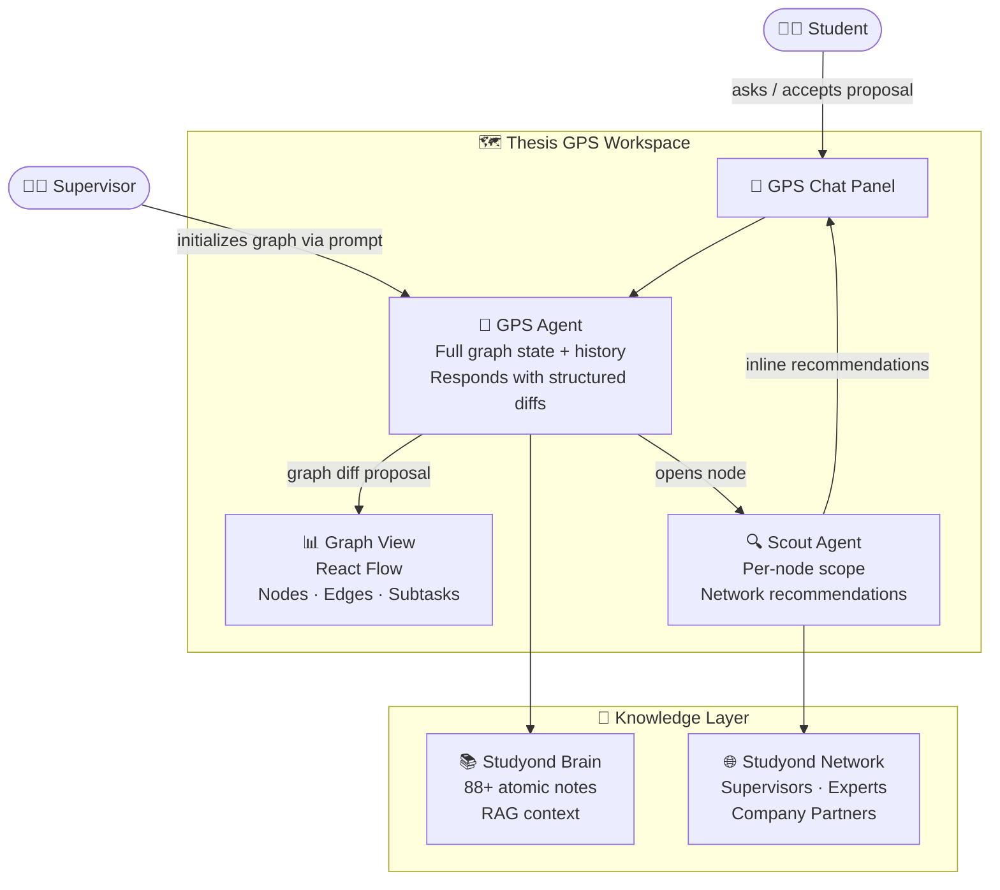

**GPS Agent** — the primary advisor. On every turn it receives the full graph state and the complete conversation history. It responds with a **structured diff**: which nodes to add, update, or remove; which edges to rewire; which subtasks to mark complete. Nothing mutates until the student accepts the proposal.

**Scout Agent** — a sub-agent scoped to a single open node. When a student expands a milestone, Scout searches the full Studyond network and surfaces the specific supervisors, domain experts, and company partners most relevant to *that* step. Recommendations are embedded inline in the chat response.

Both agents are fully stateful — conversation history and graph state persist across the entire session. This is not a one-shot chatbot bolted onto a planner.

---

### 👥 One Roadmap, Three Stakeholders

The graph is the **single source of truth** shared between all parties:

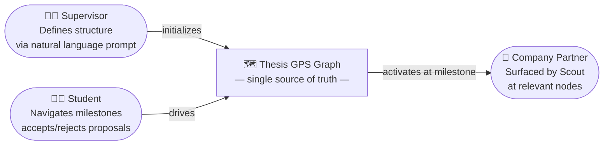

| Stakeholder | What they see | What they contribute |
|-------------|---------------|----------------------|
| **👨‍🎓 Student** | Milestone progress, upcoming steps, blocked paths | Completes tasks, steers the agent in conversation |
| **🧑‍🏫 Supervisor** | The same graph, initialized from their own prompt | Defines thesis structure and milestones at the start |
| **🏢 Company Partner** | Nodes where their domain is relevant | Surfaced by Scout at the right milestone, not cold-contacted |

The supervisor submits a natural language prompt describing requirements and milestones. The init agent translates it into the graph structure — no manual node creation, no spreadsheet handoff.

---

### 🌐 Network Exploitation at Every Milestone

The network — supervisors, domain experts, company thesis partners — is not a static directory to browse. The Scout agent **activates it contextually**:

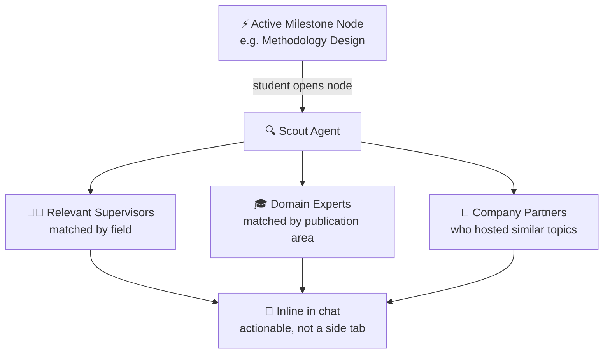

- At a *Literature Review* node → surfaces relevant academics and published supervisors
- At a *Company Case Study* node → surfaces partners who've hosted similar thesis topics
- At a *Methodology Design* node → surfaces experts whose work matches the student's approach

The network becomes a **proactive opportunity engine** embedded in the workflow, not a side tab the student forgets to visit.

---

### ✋ Proposal-First, Human-in-the-Loop UX

The GPS Agent never unilaterally mutates the graph. Every structural change is a **proposal** — a diff showing exactly which nodes and edges will be added, updated, or removed. The student reviews it in the chat panel and accepts or rejects. AI reasons, human decides.

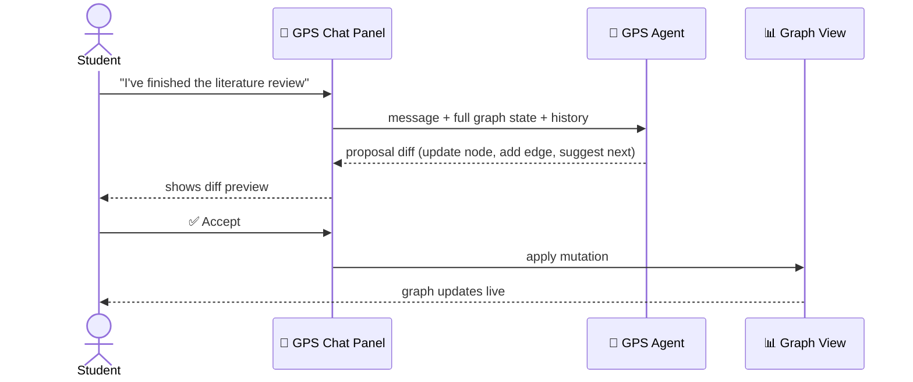

---

### 🧠 RAG over the Studyond Brain

All agent calls are grounded in the **Studyond Brain** — 88+ interconnected atomic notes covering the thesis journey, domain model, student personas, and platform context. Context is injected selectively per call, keeping responses precise and grounded.

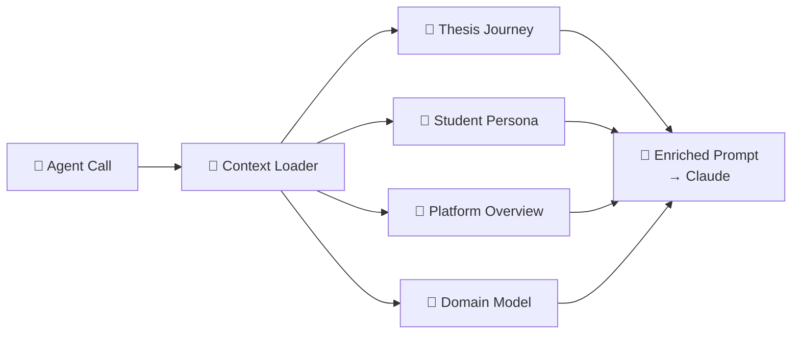

---

## 🏗️ Stack

**React 19 · TypeScript · React Flow · Tailwind CSS · shadcn/ui · Claude (Anthropic SDK) · Vercel AI SDK · Zustand · Next.js**

---

## ✨ Supporting Features

Profile & portfolio with AI relevance sorting, expert and supervisor matching network, conversational thesis orientation, and interview prep coach — all feeding into and out of the GPS workspace.

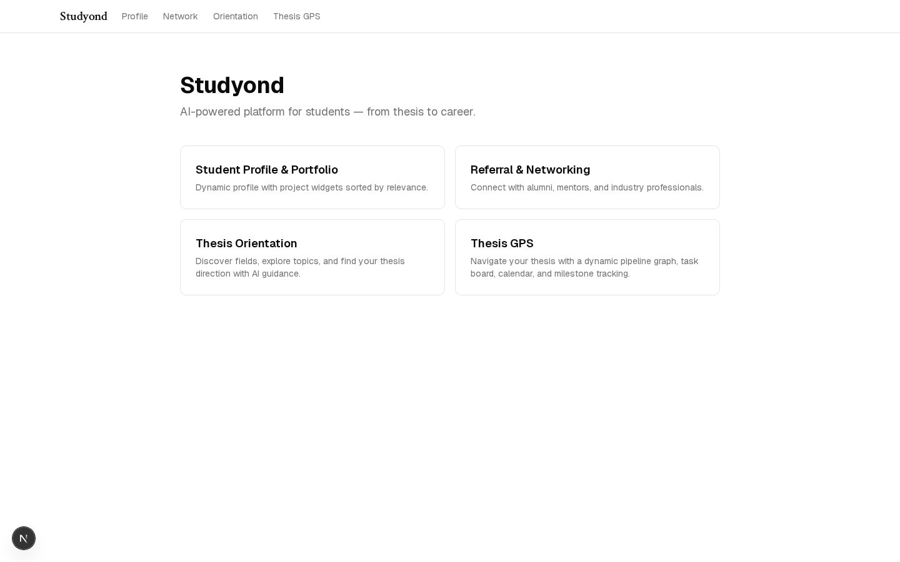
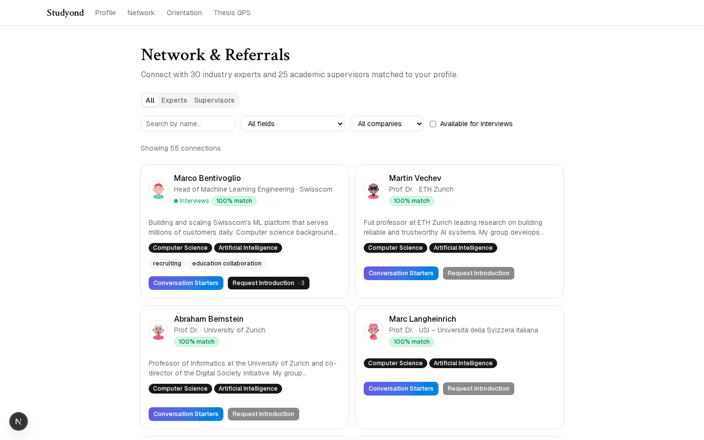
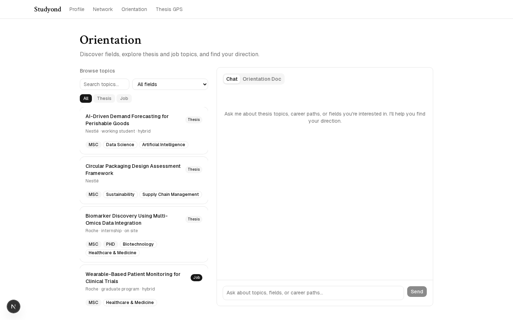
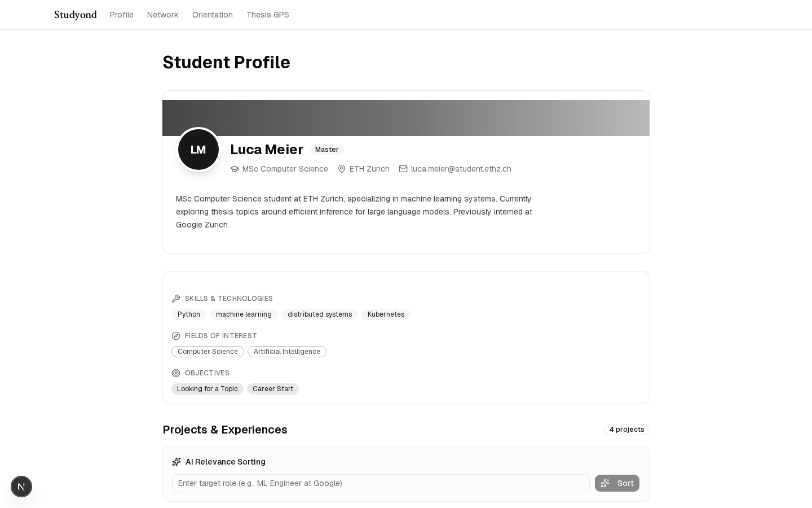
